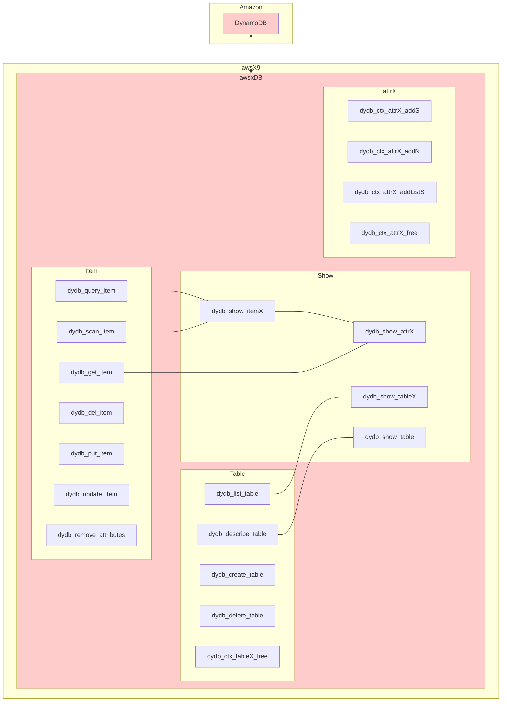
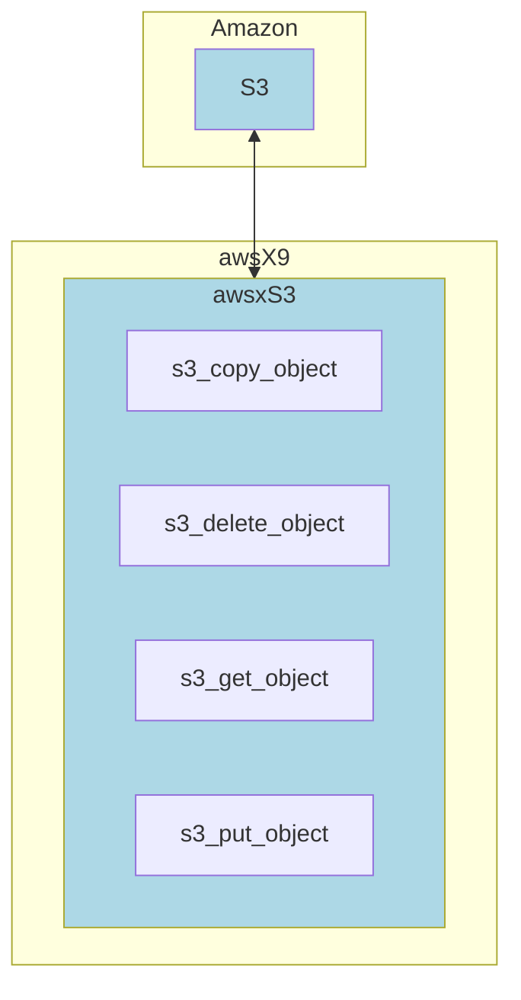

# 1. Overview

> awsX9 is an api of [AWS SDK (C++)](https://github.com/aws/aws-sdk-cpp) . We can save our time from learning AWS SDK.
>
> Please also read [helper_AWS-CLI.md](https://github.com/lankahsu520/HelperX/blob/master/helper_AWS-CLI.md) and [helper_AWS-SDK.md](https://github.com/lankahsu520/HelperX/blob/master/helper_AWS-SDK.md).


# 2. Depend on

#### - [utilx9](https://github.com/lankahsu520/utilx9)
#### - [AWS SDK (C++)](https://www.silabs.com/wireless/z-wave) (aws-sdk-cpp-1.10.9)

# 3. Current Status

## 3.1. DynamoDB

## 3.2. S3

# 4. Build

> 已經整合進 [xbox9](https://github.com/lankahsu520/xbox9)，相關步驟請參考 [xbox9](https://github.com/lankahsu520/xbox9)。

   ```bash
$ pwd
/work/xbox9
$ cd user/vendor/aws/awsX9
$ make distclean
# update 
$ make
   ```

# 5. Example or Usage
#### - awsx_123 - an example. to get item from Amazon DynamoDB.
```bash
$ ./awsx_123
Usage: awsx_123
  -d, --debug       debug level
  -b, --db          DynamoDB Demo
  -s, --s3          S3 Demo
  -h, --help
Version: 0x01004000, 2662, 1671202359, lanka, 1671254781
Example:
  awsx_123 -d 4
```
```bash
$ ./awsx_123 -s
[551701/551701] aws_s3_demo:201 - __________ Enter __________
[551701/551701] aws_s3_demo:209 - >>>>> s3_put_object (local -> bucket/key) <<<<<
[551701/551701] s3_put_object:183 - (localname: README.md -> bucket: utilx9/love_letter_s3.txt)
[551701/551701] s3_put_object:202 - PutObject ok !!! (localname: README.md -> bucket: utilx9/love_letter_s3.txt)
[551701/551701] aws_s3_demo:215 - >>>>> s3_get_object (bucket/key -> local) <<<<<
[551701/551701] s3_get_object:139 - (bucket: utilx9/love_letter_s3.txt -> localname: love_letter.txt)
[551701/551701] s3_get_object:152 - GetObject ok !!! (bucket: utilx9/love_letter_s3.txt -> saveto: love_letter.txt)
[551701/551701] aws_s3_demo:221 - >>>>> s3_copy_object (bucket/key -> bucket/key) <<<<<
[551701/551701] s3_copy_object:55 - (bucket: utilx9/love_letter_cpy.txt -> bucket: utilx9/love_letter_bak.txt)
[551701/551701] s3_copy_object:68 - CopyObject ok !!! (bucket: utilx9/love_letter_cpy.txt -> bucket: utilx9/love_letter_bak.txt)
[551701/551701] aws_s3_demo:227 - >>>>> s3_get_object (bucket/key -> NULL) <<<<<
[551701/551701] s3_delete_object:97 - (bucket: utilx9/love_letter_bak.txt -> NULL)
[551701/551701] s3_delete_object:107 - DeleteObject ok !!! (bucket: utilx9/love_letter_bak.txt -> NULL)
[551701/551701] main:412 - Bye-Bye !!!

```

```bash
$ ./awsx_123 -b
[547539/547539] aws_dynamodb_test:81 - __________ Enter __________
[547539/547539] aws_dynamodb_test:92 - >>>>> dydb_del_item <<<<<
[547539/547539] dydb_del_item:360 - DeleteItem ok !!! (table_name: Music, Artist: Lanka, SongTitle: Lanka)
[547539/547539] aws_dynamodb_test:100 - >>>>> dydb_put_item <<<<<
[547539/547539] dydb_put_item:463 - PutItem ok !!! (table_name: Music, Artist: Lanka, SongTitle: Lanka)
[547539/547539] dydb_get_item:418 - GetItem ok !!! (table_name: Music, Artist: Lanka, SongTitle: Lanka, attr_size: 5)
[547539/547539] dydb_show_attr:61 - (STRING: {"S":"Album123"}, AlbumTitle: Album123)
[547539/547539] dydb_show_attr:61 - (STRING: {"S":"Lanka"}, Artist: Lanka)
[547539/547539] dydb_show_attr:61 - (STRING: {"S":"1"}, Awards: 1)
[547539/547539] dydb_show_attr:61 - (STRING: {"S":"Lanka"}, SongTitle: Lanka)
[547539/547539] dydb_show_attr:86 - (ATTRIBUTE_LIST: {"L":[{"S":"dog"},{"S":"mouse"},{"S":"tiger"}]})
[547539/547539] dydb_show_attr:89 - (Sponsor[0]: dog)
[547539/547539] dydb_show_attr:89 - (Sponsor[1]: mouse)
[547539/547539] dydb_show_attr:89 - (Sponsor[2]: tiger)
[547539/547539] aws_dynamodb_test:121 - >>>>> dydb_update_item <<<<<
[547539/547539] dydb_update_item:697 - UpdateItem ok !!! (table_name: Music, Artist: Lanka, SongTitle: Lanka), (SET #0=:value0,#1=:value1)
[547539/547539] dydb_get_item:418 - GetItem ok !!! (table_name: Music, Artist: Lanka, SongTitle: Lanka, attr_size: 6)
[547539/547539] dydb_show_attr:61 - (STRING: {"S":"Album123"}, AlbumTitle: Album123)
[547539/547539] dydb_show_attr:61 - (STRING: {"S":"Lanka"}, Artist: Lanka)
[547539/547539] dydb_show_attr:61 - (STRING: {"S":"1"}, Awards: 1)
[547539/547539] dydb_show_attr:61 - (STRING: {"S":"Lanka"}, SongTitle: Lanka)
[547539/547539] dydb_show_attr:86 - (ATTRIBUTE_LIST: {"L":[{"S":"dog"},{"S":"mouse"},{"S":"tiger"}]})
[547539/547539] dydb_show_attr:89 - (Sponsor[0]: dog)
[547539/547539] dydb_show_attr:89 - (Sponsor[1]: mouse)
[547539/547539] dydb_show_attr:89 - (Sponsor[2]: tiger)
[547539/547539] dydb_show_attr:64 - (NUMBER: {"N":"4567"}, garbage: 4567)
[547539/547539] aws_dynamodb_test:137 - >>>>> dydb_remove_attributes <<<<<
[547539/547539] dydb_remove_attributes:569 - UpdateItem ok !!! (table_name: Music, Artist: Lanka, SongTitle: Lanka), (REMOVE garbage)
[547539/547539] dydb_get_item:418 - GetItem ok !!! (table_name: Music, Artist: Lanka, SongTitle: Lanka, attr_size: 5)
[547539/547539] dydb_show_attr:61 - (STRING: {"S":"Album123"}, AlbumTitle: Album123)
[547539/547539] dydb_show_attr:61 - (STRING: {"S":"Lanka"}, Artist: Lanka)
[547539/547539] dydb_show_attr:61 - (STRING: {"S":"1"}, Awards: 1)
[547539/547539] dydb_show_attr:61 - (STRING: {"S":"Lanka"}, SongTitle: Lanka)
[547539/547539] dydb_show_attr:86 - (ATTRIBUTE_LIST: {"L":[{"S":"dog"},{"S":"mouse"},{"S":"tiger"}]})
[547539/547539] dydb_show_attr:89 - (Sponsor[0]: dog)
[547539/547539] dydb_show_attr:89 - (Sponsor[1]: mouse)
[547539/547539] dydb_show_attr:89 - (Sponsor[2]: tiger)
[547539/547539] aws_dynamodb_test:147 - >>>>> dydb_query_item <<<<<
[547539/547539] dydb_query_item:532 - Query ok !!! (table_name: Music, Artist: Lanka, items_size: 2)
[547539/547539] dydb_show_itemX:125 - ———————————————————————————————————————————————————
[547539/547539] dydb_show_itemX:129 - __________ 000 __________
[547539/547539] dydb_show_attr:61 - (STRING: {"S":"Album123"}, AlbumTitle: Album123)
[547539/547539] dydb_show_attr:61 - (STRING: {"S":"Lanka"}, Artist: Lanka)
[547539/547539] dydb_show_attr:61 - (STRING: {"S":"1"}, Awards: 1)
[547539/547539] dydb_show_attr:61 - (STRING: {"S":"Lanka"}, SongTitle: Lanka)
[547539/547539] dydb_show_attr:86 - (ATTRIBUTE_LIST: {"L":[{"S":"dog"},{"S":"mouse"},{"S":"tiger"}]})
[547539/547539] dydb_show_attr:89 - (Sponsor[0]: dog)
[547539/547539] dydb_show_attr:89 - (Sponsor[1]: mouse)
[547539/547539] dydb_show_attr:89 - (Sponsor[2]: tiger)
[547539/547539] dydb_show_itemX:129 - __________ 001 __________
[547539/547539] dydb_show_attr:61 - (STRING: {"S":"Lanka520"}, AlbumTitle: Lanka520)
[547539/547539] dydb_show_attr:61 - (STRING: {"S":"Lanka"}, Artist: Lanka)
[547539/547539] dydb_show_attr:61 - (STRING: {"S":"1"}, Awards: 1)
[547539/547539] dydb_show_attr:61 - (STRING: {"S":"Lanka520520"}, SongTitle: Lanka520520)
[547539/547539] dydb_show_attr:86 - (ATTRIBUTE_LIST: {"L":[{"S":"dog"},{"S":"cat"},{"S":"mouse"},{"S":"stoat"},{"S":"snake"}]})
[547539/547539] dydb_show_attr:89 - (Sponsor[0]: dog)
[547539/547539] dydb_show_attr:89 - (Sponsor[1]: cat)
[547539/547539] dydb_show_attr:89 - (Sponsor[2]: mouse)
[547539/547539] dydb_show_attr:89 - (Sponsor[3]: stoat)
[547539/547539] dydb_show_attr:89 - (Sponsor[4]: snake)
[547539/547539] dydb_show_itemX:139 - _______________________ End _______________________
[547539/547539] aws_dynamodb_test:155 - >>>>> dydb_scan_item <<<<<
[547539/547539] dydb_scan_item:630 - Scan ok !!! (table_name: Music, Artist: Lanka, items_size: 6)
[547539/547539] dydb_show_itemX:125 - ———————————————————————————————————————————————————
[547539/547539] dydb_show_itemX:129 - __________ 000 __________
[547539/547539] dydb_show_attr:61 - (STRING: {"S":"Somewhat Famous"}, AlbumTitle: Somewhat Famous)
[547539/547539] dydb_show_attr:61 - (STRING: {"S":"No One You Know"}, Artist: No One You Know)
[547539/547539] dydb_show_attr:61 - (STRING: {"S":"1"}, Awards: 1)
[547539/547539] dydb_show_attr:61 - (STRING: {"S":"Call Me Today"}, SongTitle: Call Me Today)
[547539/547539] dydb_show_itemX:129 - __________ 001 __________
[547539/547539] dydb_show_attr:61 - (STRING: {"S":"Somewhat Famous"}, AlbumTitle: Somewhat Famous)
[547539/547539] dydb_show_attr:61 - (STRING: {"S":"No One You Know"}, Artist: No One You Know)
[547539/547539] dydb_show_attr:61 - (STRING: {"S":"2"}, Awards: 2)
[547539/547539] dydb_show_attr:61 - (STRING: {"S":"Howdy"}, SongTitle: Howdy)
[547539/547539] dydb_show_itemX:129 - __________ 002 __________
[547539/547539] dydb_show_attr:61 - (STRING: {"S":"Album123"}, AlbumTitle: Album123)
[547539/547539] dydb_show_attr:61 - (STRING: {"S":"Lanka"}, Artist: Lanka)
[547539/547539] dydb_show_attr:61 - (STRING: {"S":"1"}, Awards: 1)
[547539/547539] dydb_show_attr:61 - (STRING: {"S":"Lanka"}, SongTitle: Lanka)
[547539/547539] dydb_show_attr:86 - (ATTRIBUTE_LIST: {"L":[{"S":"dog"},{"S":"mouse"},{"S":"tiger"}]})
[547539/547539] dydb_show_attr:89 - (Sponsor[0]: dog)
[547539/547539] dydb_show_attr:89 - (Sponsor[1]: mouse)
[547539/547539] dydb_show_attr:89 - (Sponsor[2]: tiger)
[547539/547539] dydb_show_itemX:129 - __________ 003 __________
[547539/547539] dydb_show_attr:61 - (STRING: {"S":"Lanka520"}, AlbumTitle: Lanka520)
[547539/547539] dydb_show_attr:61 - (STRING: {"S":"Lanka"}, Artist: Lanka)
[547539/547539] dydb_show_attr:61 - (STRING: {"S":"1"}, Awards: 1)
[547539/547539] dydb_show_attr:61 - (STRING: {"S":"Lanka520520"}, SongTitle: Lanka520520)
[547539/547539] dydb_show_attr:86 - (ATTRIBUTE_LIST: {"L":[{"S":"dog"},{"S":"cat"},{"S":"mouse"},{"S":"stoat"},{"S":"snake"}]})
[547539/547539] dydb_show_attr:89 - (Sponsor[0]: dog)
[547539/547539] dydb_show_attr:89 - (Sponsor[1]: cat)
[547539/547539] dydb_show_attr:89 - (Sponsor[2]: mouse)
[547539/547539] dydb_show_attr:89 - (Sponsor[3]: stoat)
[547539/547539] dydb_show_attr:89 - (Sponsor[4]: snake)
[547539/547539] dydb_show_itemX:129 - __________ 004 __________
[547539/547539] dydb_show_attr:61 - (STRING: {"S":"Songs About Life"}, AlbumTitle: Songs About Life)
[547539/547539] dydb_show_attr:61 - (STRING: {"S":"Acme Band"}, Artist: Acme Band)
[547539/547539] dydb_show_attr:61 - (STRING: {"S":"10"}, Awards: 10)
[547539/547539] dydb_show_attr:61 - (STRING: {"S":"Happy Day"}, SongTitle: Happy Day)
[547539/547539] dydb_show_itemX:129 - __________ 005 __________
[547539/547539] dydb_show_attr:61 - (STRING: {"S":"Another Album Title"}, AlbumTitle: Another Album Title)
[547539/547539] dydb_show_attr:61 - (STRING: {"S":"Acme Band"}, Artist: Acme Band)
[547539/547539] dydb_show_attr:61 - (STRING: {"S":"8"}, Awards: 8)
[547539/547539] dydb_show_attr:61 - (STRING: {"S":"PartiQL Rocks"}, SongTitle: PartiQL Rocks)
[547539/547539] dydb_show_itemX:139 - _______________________ End _______________________
[547539/547539] dydb_show_tableX:172 - ———————————————————————————————————————————————————
[547539/547539] dydb_show_tableX:175 - (tablename: Music)
[547539/547539] dydb_show_tableX:177 - _______________________ End _______________________
[547539/547539] aws_dynamodb_test:171 - >>>>> dydb_create_table <<<<<
[547539/547539] dydb_create_table:218 - CreateTable ok !!! (table_name: Demo, PK: Lanka, SK: Happy Day)
[547539/547539] dydb_show_tableX:172 - ———————————————————————————————————————————————————
[547539/547539] dydb_show_tableX:175 - (tablename: Demo)
[547539/547539] dydb_show_tableX:175 - (tablename: Music)
[547539/547539] dydb_show_tableX:177 - _______________________ End _______________________
[547539/547539] aws_dynamodb_test:178 - >>>>> dydb_describe_table <<<<<
[547539/547539] dydb_describe_table:291 - DescribeTable ok !!! (table_name: Demo)
[547539/547539] dydb_show_table:148 - (Table Name: Demo)
[547539/547539] dydb_show_table:149 - (Table ARN: arn:aws:dynamodb:eu-west-1:123456789012:table/Demo)
[547539/547539] dydb_show_table:150 - (Table Status: CREATING)
[547539/547539] dydb_show_table:151 - (Table ItemCount: 0)
[547539/547539] dydb_show_table:152 - (Table Size: 0 bytes)
[547539/547539] dydb_show_table:155 - (Throughput Read: 5, Write: 5)
[547539/547539] dydb_show_table:161 - (Attributes[S]: PK)
[547539/547539] dydb_show_table:161 - (Attributes[S]: SK)
[547539/547539] aws_dynamodb_test:183 - >>>>> dydb_delete_table <<<<<
[547539/547539] dydb_delete_table:255 - DeleteTable ok !!! (table_name: Demo)
[547539/547539] dydb_describe_table:291 - DescribeTable ok !!! (table_name: Demo)
[547539/547539] dydb_describe_table:295 - DescribeTable error - Requested resource not found: Table: Demo not found !!! (table_name: Demo)
[547539/547539] dydb_show_tableX:172 - ———————————————————————————————————————————————————
[547539/547539] dydb_show_tableX:175 - (tablename: Music)
[547539/547539] dydb_show_tableX:177 - _______________________ End _______________________
[547539/547539] main:388 - Bye-Bye !!!

```


# 6. Documentation
> Run an example and read it.

## 6.1. [DynamoDB](https://docs.aws.amazon.com/sdk-for-cpp/v1/developer-guide/examples-dynamodb.html)

| DynamoDB | SQL Database |
| -------- | -------------- |
| Table | Table |
| Item | Row |
| Attribute | Column |

## 6.2. [S3](https://docs.aws.amazon.com/sdk-for-cpp/v1/developer-guide/examples-s3.html)

| S3 | File |
| -------- | -------------- |
| Bucket | Folder |
| Key | File |
|  |  |

# Appendix

# I. Study

# II. Debug

# III. Glossary

# IV. Tool Usage

# Author

> Created and designed by [Lanka Hsu](lankahsu@gmail.com).

# License

> [awsX9](https://github.com/lankahsu520/awsX9) is under the New BSD License (BSD-3-Clause).