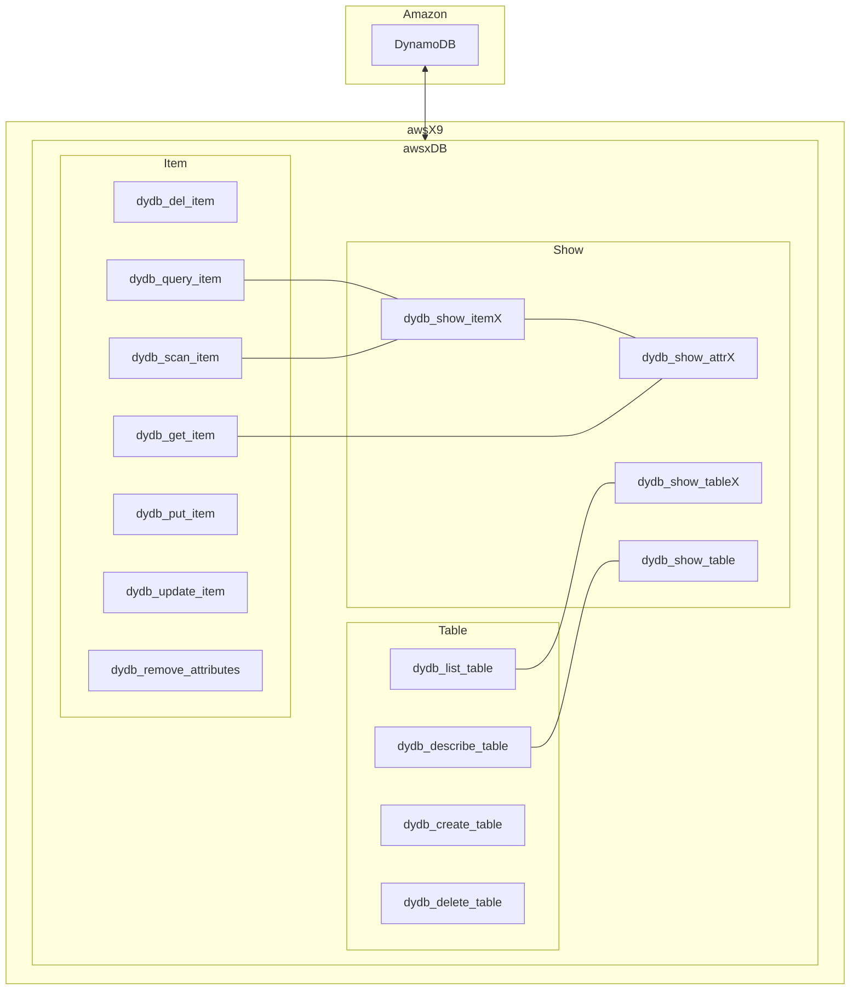

# 1. Overview
awsX9 is an api of [AWS SDK (C++)](https://github.com/aws/aws-sdk-cpp) . We can save our time from learning AWS SDK.

Please also read [helper_AWS-CLI.md](https://github.com/lankahsu520/HelperX/blob/master/helper_AWS-CLI.md) and [helper_AWS-SDK.md](https://github.com/lankahsu520/HelperX/blob/master/helper_AWS-SDK.md).


```mermaid
flowchart TD
	subgraph Amazon
		DynamoDB
	end

	DynamoDB <--> awsxDB
	subgraph awsX9
		subgraph awsxDB
			subgraph Show
				dydb_show_attrX
				dydb_show_itemX --- dydb_show_attrX
				dydb_show_tableX
				dydb_show_table
			end
			subgraph Table
				dydb_create_table
				dydb_delete_table
				dydb_list_table --- dydb_show_tableX
				dydb_describe_table --- dydb_show_table
			end

			subgraph Item
				dydb_del_item
				dydb_put_item
				dydb_update_item
				dydb_remove_attributes

				dydb_get_item --- dydb_show_attrX
				dydb_query_item --- dydb_show_itemX
				dydb_scan_item --- dydb_show_itemX
			end
		end
	end
```
# 2. Depend on
- [utilx9](https://github.com/lankahsu520/utilx9)
- [AWS SDK (C++)](https://www.silabs.com/wireless/z-wave) (aws-sdk-cpp-1.10.9)

# 3. Current Status

#### A. DynamoDB


# 4. Build

   ```bash
$ vi utilx9/conf/github.conf
export PJ_HAS_AWSX9=yes
export PJ_HAS_AWS_SDK_CPP=yes
# please build AWS SDK C++ by yourself.
# or update utilx9/user/library_pub.mk
$ make
   ```

# 5. Example or Usage
- awsx_123 - an example. to get item from Amazon DynamoDB.
```bash
$ ./awsx_123
[7709/7709] aws_open:78 - >>>>> dydb_del_item <<<<<
[7709/7709] dydb_del_item:361 - DeleteItem ok !!! (table_name: Music, Artist: Lanka, SongTitle: Lanka)
[7709/7709] aws_open:86 - >>>>> dydb_put_item <<<<<
[7709/7709] dydb_put_item:464 - PutItem ok !!! (table_name: Music, Artist: Lanka, SongTitle: Lanka)
[7709/7709] dydb_get_item:419 - GetItem ok !!! (table_name: Music, Artist: Lanka, SongTitle: Lanka, attr_size: 5)
[7709/7709] dydb_show_attr:61 - (STRING: {"S":"Album123"}, AlbumTitle: Album123)
[7709/7709] dydb_show_attr:61 - (STRING: {"S":"Lanka"}, Artist: Lanka)
[7709/7709] dydb_show_attr:61 - (STRING: {"S":"1"}, Awards: 1)
[7709/7709] dydb_show_attr:61 - (STRING: {"S":"Lanka"}, SongTitle: Lanka)
[7709/7709] dydb_show_attr:86 - (ATTRIBUTE_LIST: {"L":[{"S":"dog"},{"S":"mouse"},{"S":"tiger"}]})
[7709/7709] dydb_show_attr:89 - (Sponsor[0]: dog)
[7709/7709] dydb_show_attr:89 - (Sponsor[1]: mouse)
[7709/7709] dydb_show_attr:89 - (Sponsor[2]: tiger)
[7709/7709] aws_open:107 - >>>>> dydb_update_item <<<<<
[7709/7709] dydb_update_item:698 - UpdateItem ok !!! (table_name: Music, Artist: Lanka, SongTitle: Lanka), (SET #0=:value0,#1=:value1)
[7709/7709] dydb_get_item:419 - GetItem ok !!! (table_name: Music, Artist: Lanka, SongTitle: Lanka, attr_size: 6)
[7709/7709] dydb_show_attr:61 - (STRING: {"S":"Album123"}, AlbumTitle: Album123)
[7709/7709] dydb_show_attr:61 - (STRING: {"S":"Lanka"}, Artist: Lanka)
[7709/7709] dydb_show_attr:61 - (STRING: {"S":"1"}, Awards: 1)
[7709/7709] dydb_show_attr:61 - (STRING: {"S":"Lanka"}, SongTitle: Lanka)
[7709/7709] dydb_show_attr:86 - (ATTRIBUTE_LIST: {"L":[{"S":"dog"},{"S":"mouse"},{"S":"tiger"}]})
[7709/7709] dydb_show_attr:89 - (Sponsor[0]: dog)
[7709/7709] dydb_show_attr:89 - (Sponsor[1]: mouse)
[7709/7709] dydb_show_attr:89 - (Sponsor[2]: tiger)
[7709/7709] dydb_show_attr:64 - (NUMBER: {"N":"4567"}, garbage: 4567)
[7709/7709] aws_open:123 - >>>>> dydb_remove_attributes <<<<<
[7709/7709] dydb_remove_attributes:570 - UpdateItem ok !!! (table_name: Music, Artist: Lanka, SongTitle: Lanka), (REMOVE garbage)
[7709/7709] dydb_get_item:419 - GetItem ok !!! (table_name: Music, Artist: Lanka, SongTitle: Lanka, attr_size: 5)
[7709/7709] dydb_show_attr:61 - (STRING: {"S":"Album123"}, AlbumTitle: Album123)
[7709/7709] dydb_show_attr:61 - (STRING: {"S":"Lanka"}, Artist: Lanka)
[7709/7709] dydb_show_attr:61 - (STRING: {"S":"1"}, Awards: 1)
[7709/7709] dydb_show_attr:61 - (STRING: {"S":"Lanka"}, SongTitle: Lanka)
[7709/7709] dydb_show_attr:86 - (ATTRIBUTE_LIST: {"L":[{"S":"dog"},{"S":"mouse"},{"S":"tiger"}]})
[7709/7709] dydb_show_attr:89 - (Sponsor[0]: dog)
[7709/7709] dydb_show_attr:89 - (Sponsor[1]: mouse)
[7709/7709] dydb_show_attr:89 - (Sponsor[2]: tiger)
[7709/7709] aws_open:133 - >>>>> dydb_query_item <<<<<
[7709/7709] dydb_query_item:533 - Query ok !!! (table_name: Music, Artist: Lanka, items_size: 2)
[7709/7709] dydb_show_itemX:125 - ——————————————————————————————————————————————————
[7709/7709] dydb_show_itemX:129 - __________ 000 __________
[7709/7709] dydb_show_attr:61 - (STRING: {"S":"Album123"}, AlbumTitle: Album123)
[7709/7709] dydb_show_attr:61 - (STRING: {"S":"Lanka"}, Artist: Lanka)
[7709/7709] dydb_show_attr:61 - (STRING: {"S":"1"}, Awards: 1)
[7709/7709] dydb_show_attr:61 - (STRING: {"S":"Lanka"}, SongTitle: Lanka)
[7709/7709] dydb_show_attr:86 - (ATTRIBUTE_LIST: {"L":[{"S":"dog"},{"S":"mouse"},{"S":"tiger"}]})
[7709/7709] dydb_show_attr:89 - (Sponsor[0]: dog)
[7709/7709] dydb_show_attr:89 - (Sponsor[1]: mouse)
[7709/7709] dydb_show_attr:89 - (Sponsor[2]: tiger)
[7709/7709] dydb_show_itemX:129 - __________ 001 __________
[7709/7709] dydb_show_attr:61 - (STRING: {"S":"Lanka520"}, AlbumTitle: Lanka520)
[7709/7709] dydb_show_attr:61 - (STRING: {"S":"Lanka"}, Artist: Lanka)
[7709/7709] dydb_show_attr:61 - (STRING: {"S":"1"}, Awards: 1)
[7709/7709] dydb_show_attr:61 - (STRING: {"S":"Lanka520520"}, SongTitle: Lanka520520)
[7709/7709] dydb_show_attr:86 - (ATTRIBUTE_LIST: {"L":[{"S":"dog"},{"S":"cat"},{"S":"mouse"},{"S":"stoat"},{"S":"snake"}]})
[7709/7709] dydb_show_attr:89 - (Sponsor[0]: dog)
[7709/7709] dydb_show_attr:89 - (Sponsor[1]: cat)
[7709/7709] dydb_show_attr:89 - (Sponsor[2]: mouse)
[7709/7709] dydb_show_attr:89 - (Sponsor[3]: stoat)
[7709/7709] dydb_show_attr:89 - (Sponsor[4]: snake)
[7709/7709] dydb_show_itemX:139 - __________ End __________
[7709/7709] aws_open:141 - >>>>> dydb_scan_item <<<<<
[7709/7709] dydb_scan_item:631 - Scan ok !!! (table_name: Music, Artist: Lanka, items_size: 6)
[7709/7709] dydb_show_itemX:125 - ——————————————————————————————————————————————————
[7709/7709] dydb_show_itemX:129 - __________ 000 __________
[7709/7709] dydb_show_attr:61 - (STRING: {"S":"Somewhat Famous"}, AlbumTitle: Somewhat Famous)
[7709/7709] dydb_show_attr:61 - (STRING: {"S":"No One You Know"}, Artist: No One You Know)
[7709/7709] dydb_show_attr:61 - (STRING: {"S":"1"}, Awards: 1)
[7709/7709] dydb_show_attr:61 - (STRING: {"S":"Call Me Today"}, SongTitle: Call Me Today)
[7709/7709] dydb_show_itemX:129 - __________ 001 __________
[7709/7709] dydb_show_attr:61 - (STRING: {"S":"Somewhat Famous"}, AlbumTitle: Somewhat Famous)
[7709/7709] dydb_show_attr:61 - (STRING: {"S":"No One You Know"}, Artist: No One You Know)
[7709/7709] dydb_show_attr:61 - (STRING: {"S":"2"}, Awards: 2)
[7709/7709] dydb_show_attr:61 - (STRING: {"S":"Howdy"}, SongTitle: Howdy)
[7709/7709] dydb_show_itemX:129 - __________ 002 __________
[7709/7709] dydb_show_attr:61 - (STRING: {"S":"Album123"}, AlbumTitle: Album123)
[7709/7709] dydb_show_attr:61 - (STRING: {"S":"Lanka"}, Artist: Lanka)
[7709/7709] dydb_show_attr:61 - (STRING: {"S":"1"}, Awards: 1)
[7709/7709] dydb_show_attr:61 - (STRING: {"S":"Lanka"}, SongTitle: Lanka)
[7709/7709] dydb_show_attr:86 - (ATTRIBUTE_LIST: {"L":[{"S":"dog"},{"S":"mouse"},{"S":"tiger"}]})
[7709/7709] dydb_show_attr:89 - (Sponsor[0]: dog)
[7709/7709] dydb_show_attr:89 - (Sponsor[1]: mouse)
[7709/7709] dydb_show_attr:89 - (Sponsor[2]: tiger)
[7709/7709] dydb_show_itemX:129 - __________ 003 __________
[7709/7709] dydb_show_attr:61 - (STRING: {"S":"Lanka520"}, AlbumTitle: Lanka520)
[7709/7709] dydb_show_attr:61 - (STRING: {"S":"Lanka"}, Artist: Lanka)
[7709/7709] dydb_show_attr:61 - (STRING: {"S":"1"}, Awards: 1)
[7709/7709] dydb_show_attr:61 - (STRING: {"S":"Lanka520520"}, SongTitle: Lanka520520)
[7709/7709] dydb_show_attr:86 - (ATTRIBUTE_LIST: {"L":[{"S":"dog"},{"S":"cat"},{"S":"mouse"},{"S":"stoat"},{"S":"snake"}]})
[7709/7709] dydb_show_attr:89 - (Sponsor[0]: dog)
[7709/7709] dydb_show_attr:89 - (Sponsor[1]: cat)
[7709/7709] dydb_show_attr:89 - (Sponsor[2]: mouse)
[7709/7709] dydb_show_attr:89 - (Sponsor[3]: stoat)
[7709/7709] dydb_show_attr:89 - (Sponsor[4]: snake)
[7709/7709] dydb_show_itemX:129 - __________ 004 __________
[7709/7709] dydb_show_attr:61 - (STRING: {"S":"Songs About Life"}, AlbumTitle: Songs About Life)
[7709/7709] dydb_show_attr:61 - (STRING: {"S":"Acme Band"}, Artist: Acme Band)
[7709/7709] dydb_show_attr:61 - (STRING: {"S":"10"}, Awards: 10)
[7709/7709] dydb_show_attr:61 - (STRING: {"S":"Happy Day"}, SongTitle: Happy Day)
[7709/7709] dydb_show_itemX:129 - __________ 005 __________
[7709/7709] dydb_show_attr:61 - (STRING: {"S":"Another Album Title"}, AlbumTitle: Another Album Title)
[7709/7709] dydb_show_attr:61 - (STRING: {"S":"Acme Band"}, Artist: Acme Band)
[7709/7709] dydb_show_attr:61 - (STRING: {"S":"8"}, Awards: 8)
[7709/7709] dydb_show_attr:61 - (STRING: {"S":"PartiQL Rocks"}, SongTitle: PartiQL Rocks)
[7709/7709] dydb_show_itemX:139 - __________ End __________
[7709/7709] dydb_show_tableX:172 - ——————————————————————————————————————————————————
[7709/7709] dydb_show_tableX:175 - (tablename: Music)
[7709/7709] dydb_show_tableX:177 - __________ End __________
[7709/7709] aws_open:158 - >>>>> dydb_create_table <<<<<
[7709/7709] dydb_create_table:218 - CreateTable ok !!! (table_name: Demo, PK: Lanka, SK: Happy Day)
[7709/7709] dydb_show_tableX:172 - ——————————————————————————————————————————————————
[7709/7709] dydb_show_tableX:175 - (tablename: Demo)
[7709/7709] dydb_show_tableX:175 - (tablename: Music)
[7709/7709] dydb_show_tableX:177 - __________ End __________
[7709/7709] aws_open:165 - >>>>> dydb_describe_table <<<<<
[7709/7709] dydb_describe_table:286 - DescribeTable ok !!! (table_name: Demo)
[7709/7709] dydb_show_table:148 - (Table Name: Demo)
[7709/7709] dydb_show_table:149 - (Table ARN: arn:aws:dynamodb:eu-west-1:877409487449:table/Demo)
[7709/7709] dydb_show_table:150 - (Table Status: CREATING)
[7709/7709] dydb_show_table:151 - (Table ItemCount: 0)
[7709/7709] dydb_show_table:152 - (Table Size: 0 bytes)
[7709/7709] dydb_show_table:155 - (Throughput Read: 5, Write: 5)
[7709/7709] dydb_show_table:161 - (Attributes[S]: PK)
[7709/7709] dydb_show_table:161 - (Attributes[S]: SK)
[7709/7709] aws_open:169 - >>>>> dydb_delete_table <<<<<
[7709/7709] dydb_delete_table:255 - DeleteTable ok !!! (table_name: Demo)
[7709/7709] dydb_describe_table:286 - DescribeTable ok !!! (table_name: Demo)
[7709/7709] dydb_describe_table:286 - DescribeTable ok !!! (table_name: Demo)
[7709/7709] dydb_describe_table:296 - DescribeTable error - Requested resource not found: Table: Demo not found !!! (table_name: Demo)
[7709/7709] dydb_show_tableX:172 - ——————————————————————————————————————————————————
[7709/7709] dydb_show_tableX:175 - (tablename: Music)
[7709/7709] dydb_show_tableX:177 - __________ End __________
[7709/7709] main:321 - Bye-Bye !!!

```

# 6. License

awsX9 is under the New BSD License (BSD-3-Clause).


# 7. Documentation
Run an example and read it.
