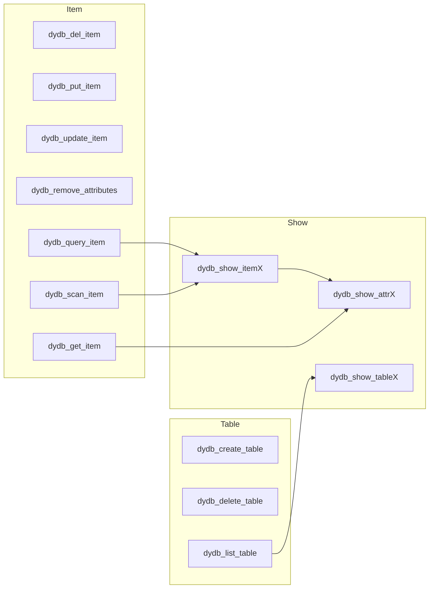

# 1. Overview
awsX9 is an api of [AWS SDK (C++)](https://github.com/aws/aws-sdk-cpp). We can save our time from learning AWS SDK.

Please also read [helper_AWS-CLI.md](https://github.com/lankahsu520/HelperX/blob/master/helper_AWS-CLI.md) and [helper_AWS-SDK.md](https://github.com/lankahsu520/HelperX/blob/master/helper_AWS-SDK.md).


```mermaid
flowchart LR
	subgraph Show
		dydb_show_attrX
		dydb_show_itemX --> dydb_show_attrX
		dydb_show_tableX
	end
	subgraph Table
    	dydb_create_table
		dydb_delete_table
		dydb_list_table --> dydb_show_tableX
	end

	subgraph Item
		dydb_del_item
		dydb_put_item
		dydb_update_item
		dydb_remove_attributes

		dydb_get_item --> dydb_show_attrX
		dydb_query_item --> dydb_show_itemX
		dydb_scan_item --> dydb_show_itemX
	end
```
# 2. Depend on
- [utilx9](https://github.com/lankahsu520/utilx9)
- [AWS SDK (C++)](https://www.silabs.com/wireless/z-wave)

# 3. Current Status


# 4. Build

   ```bash
$ vi utilx9/conf/github.conf
export PJ_HAS_AWSX9=yes
export PJ_HAS_AWS_SDK_CPP=yes
# please build AWS SDK C++ by yourself.
# or update utilx9/user/library_pub.mk
$ make
   ```

# 5. Example or Usage
- awsx_123 - an example. to get item from Amazon DynamoDB.
```bash
$ ./awsx_123
[265380/265380] aws_open:78 - >>>>> dydb_del_item <<<<<
[265380/265380] dydb_del_item:293 - DeleteItem ok !!! (table_name: Music, Artist: Lanka, SongTitle: Lanka)
[265380/265380] aws_open:86 - >>>>> dydb_put_item <<<<<
[265380/265380] dydb_put_item:393 - PutItem ok !!! (table_name: Music, Artist: Lanka, SongTitle: Lanka)
[265380/265380] dydb_get_item:349 - GetItem ok !!! (table_name: Music, Artist: Lanka, SongTitle: Lanka, attr_size: 5)
[265380/265380] dydb_show_attr:59 - (STRING: {"S":"Album123"}, AlbumTitle: Album123)
[265380/265380] dydb_show_attr:59 - (STRING: {"S":"Lanka"}, Artist: Lanka)
[265380/265380] dydb_show_attr:59 - (STRING: {"S":"1"}, Awards: 1)
[265380/265380] dydb_show_attr:59 - (STRING: {"S":"Lanka"}, SongTitle: Lanka)
[265380/265380] dydb_show_attr:84 - (ATTRIBUTE_LIST: {"L":[{"S":"dog"},{"S":"mouse"},{"S":"tiger"}]})
[265380/265380] dydb_show_attr:87 - (Sponsor[0]: dog)
[265380/265380] dydb_show_attr:87 - (Sponsor[1]: mouse)
[265380/265380] dydb_show_attr:87 - (Sponsor[2]: tiger)
[265380/265380] aws_open:107 - >>>>> dydb_update_item <<<<<
[265380/265380] dydb_update_item:626 - UpdateItem ok !!! (table_name: Music, Artist: Lanka, SongTitle: Lanka), (SET #0=:value0,#1=:value1)
[265380/265380] dydb_get_item:349 - GetItem ok !!! (table_name: Music, Artist: Lanka, SongTitle: Lanka, attr_size: 6)
[265380/265380] dydb_show_attr:59 - (STRING: {"S":"Album123"}, AlbumTitle: Album123)
[265380/265380] dydb_show_attr:59 - (STRING: {"S":"Lanka"}, Artist: Lanka)
[265380/265380] dydb_show_attr:59 - (STRING: {"S":"1"}, Awards: 1)
[265380/265380] dydb_show_attr:59 - (STRING: {"S":"Lanka"}, SongTitle: Lanka)
[265380/265380] dydb_show_attr:84 - (ATTRIBUTE_LIST: {"L":[{"S":"dog"},{"S":"mouse"},{"S":"tiger"}]})
[265380/265380] dydb_show_attr:87 - (Sponsor[0]: dog)
[265380/265380] dydb_show_attr:87 - (Sponsor[1]: mouse)
[265380/265380] dydb_show_attr:87 - (Sponsor[2]: tiger)
[265380/265380] dydb_show_attr:62 - (NUMBER: {"N":"4567"}, garbage: 4567)
[265380/265380] aws_open:123 - >>>>> dydb_remove_attributes <<<<<
[265380/265380] dydb_remove_attributes:498 - UpdateItem ok !!! (table_name: Music, Artist: Lanka, SongTitle: Lanka), (REMOVE garbage)
[265380/265380] dydb_get_item:349 - GetItem ok !!! (table_name: Music, Artist: Lanka, SongTitle: Lanka, attr_size: 5)
[265380/265380] dydb_show_attr:59 - (STRING: {"S":"Album123"}, AlbumTitle: Album123)
[265380/265380] dydb_show_attr:59 - (STRING: {"S":"Lanka"}, Artist: Lanka)
[265380/265380] dydb_show_attr:59 - (STRING: {"S":"1"}, Awards: 1)
[265380/265380] dydb_show_attr:59 - (STRING: {"S":"Lanka"}, SongTitle: Lanka)
[265380/265380] dydb_show_attr:84 - (ATTRIBUTE_LIST: {"L":[{"S":"dog"},{"S":"mouse"},{"S":"tiger"}]})
[265380/265380] dydb_show_attr:87 - (Sponsor[0]: dog)
[265380/265380] dydb_show_attr:87 - (Sponsor[1]: mouse)
[265380/265380] dydb_show_attr:87 - (Sponsor[2]: tiger)
[265380/265380] aws_open:133 - >>>>> dydb_query_item <<<<<
[265380/265380] dydb_query_item:461 - Query ok !!! (table_name: Music, Artist: Lanka, items_size: 2)
[265380/265380] dydb_show_itemX:123 - ——————————————————————————————————————————————————
[265380/265380] dydb_show_itemX:127 - __________ 000 __________
[265380/265380] dydb_show_attr:59 - (STRING: {"S":"Album123"}, AlbumTitle: Album123)
[265380/265380] dydb_show_attr:59 - (STRING: {"S":"Lanka"}, Artist: Lanka)
[265380/265380] dydb_show_attr:59 - (STRING: {"S":"1"}, Awards: 1)
[265380/265380] dydb_show_attr:59 - (STRING: {"S":"Lanka"}, SongTitle: Lanka)
[265380/265380] dydb_show_attr:84 - (ATTRIBUTE_LIST: {"L":[{"S":"dog"},{"S":"mouse"},{"S":"tiger"}]})
[265380/265380] dydb_show_attr:87 - (Sponsor[0]: dog)
[265380/265380] dydb_show_attr:87 - (Sponsor[1]: mouse)
[265380/265380] dydb_show_attr:87 - (Sponsor[2]: tiger)
[265380/265380] dydb_show_itemX:127 - __________ 001 __________
[265380/265380] dydb_show_attr:59 - (STRING: {"S":"Lanka520"}, AlbumTitle: Lanka520)
[265380/265380] dydb_show_attr:59 - (STRING: {"S":"Lanka"}, Artist: Lanka)
[265380/265380] dydb_show_attr:59 - (STRING: {"S":"1"}, Awards: 1)
[265380/265380] dydb_show_attr:59 - (STRING: {"S":"Lanka520520"}, SongTitle: Lanka520520)
[265380/265380] dydb_show_attr:84 - (ATTRIBUTE_LIST: {"L":[{"S":"dog"},{"S":"cat"},{"S":"mouse"},{"S":"stoat"},{"S":"snake"}]})
[265380/265380] dydb_show_attr:87 - (Sponsor[0]: dog)
[265380/265380] dydb_show_attr:87 - (Sponsor[1]: cat)
[265380/265380] dydb_show_attr:87 - (Sponsor[2]: mouse)
[265380/265380] dydb_show_attr:87 - (Sponsor[3]: stoat)
[265380/265380] dydb_show_attr:87 - (Sponsor[4]: snake)
[265380/265380] dydb_show_itemX:137 - __________ End __________
[265380/265380] aws_open:141 - >>>>> dydb_scan_item <<<<<
[265380/265380] dydb_scan_item:559 - Scan ok !!! (table_name: Music, Artist: Lanka, items_size: 6)
[265380/265380] dydb_show_itemX:123 - ——————————————————————————————————————————————————
[265380/265380] dydb_show_itemX:127 - __________ 000 __________
[265380/265380] dydb_show_attr:59 - (STRING: {"S":"Somewhat Famous"}, AlbumTitle: Somewhat Famous)
[265380/265380] dydb_show_attr:59 - (STRING: {"S":"No One You Know"}, Artist: No One You Know)
[265380/265380] dydb_show_attr:59 - (STRING: {"S":"1"}, Awards: 1)
[265380/265380] dydb_show_attr:59 - (STRING: {"S":"Call Me Today"}, SongTitle: Call Me Today)
[265380/265380] dydb_show_itemX:127 - __________ 001 __________
[265380/265380] dydb_show_attr:59 - (STRING: {"S":"Somewhat Famous"}, AlbumTitle: Somewhat Famous)
[265380/265380] dydb_show_attr:59 - (STRING: {"S":"No One You Know"}, Artist: No One You Know)
[265380/265380] dydb_show_attr:59 - (STRING: {"S":"2"}, Awards: 2)
[265380/265380] dydb_show_attr:59 - (STRING: {"S":"Howdy"}, SongTitle: Howdy)
[265380/265380] dydb_show_itemX:127 - __________ 002 __________
[265380/265380] dydb_show_attr:59 - (STRING: {"S":"Album123"}, AlbumTitle: Album123)
[265380/265380] dydb_show_attr:59 - (STRING: {"S":"Lanka"}, Artist: Lanka)
[265380/265380] dydb_show_attr:59 - (STRING: {"S":"1"}, Awards: 1)
[265380/265380] dydb_show_attr:59 - (STRING: {"S":"Lanka"}, SongTitle: Lanka)
[265380/265380] dydb_show_attr:84 - (ATTRIBUTE_LIST: {"L":[{"S":"dog"},{"S":"mouse"},{"S":"tiger"}]})
[265380/265380] dydb_show_attr:87 - (Sponsor[0]: dog)
[265380/265380] dydb_show_attr:87 - (Sponsor[1]: mouse)
[265380/265380] dydb_show_attr:87 - (Sponsor[2]: tiger)
[265380/265380] dydb_show_itemX:127 - __________ 003 __________
[265380/265380] dydb_show_attr:59 - (STRING: {"S":"Lanka520"}, AlbumTitle: Lanka520)
[265380/265380] dydb_show_attr:59 - (STRING: {"S":"Lanka"}, Artist: Lanka)
[265380/265380] dydb_show_attr:59 - (STRING: {"S":"1"}, Awards: 1)
[265380/265380] dydb_show_attr:59 - (STRING: {"S":"Lanka520520"}, SongTitle: Lanka520520)
[265380/265380] dydb_show_attr:84 - (ATTRIBUTE_LIST: {"L":[{"S":"dog"},{"S":"cat"},{"S":"mouse"},{"S":"stoat"},{"S":"snake"}]})
[265380/265380] dydb_show_attr:87 - (Sponsor[0]: dog)
[265380/265380] dydb_show_attr:87 - (Sponsor[1]: cat)
[265380/265380] dydb_show_attr:87 - (Sponsor[2]: mouse)
[265380/265380] dydb_show_attr:87 - (Sponsor[3]: stoat)
[265380/265380] dydb_show_attr:87 - (Sponsor[4]: snake)
[265380/265380] dydb_show_itemX:127 - __________ 004 __________
[265380/265380] dydb_show_attr:59 - (STRING: {"S":"Songs About Life"}, AlbumTitle: Songs About Life)
[265380/265380] dydb_show_attr:59 - (STRING: {"S":"Acme Band"}, Artist: Acme Band)
[265380/265380] dydb_show_attr:59 - (STRING: {"S":"10"}, Awards: 10)
[265380/265380] dydb_show_attr:59 - (STRING: {"S":"Happy Day"}, SongTitle: Happy Day)
[265380/265380] dydb_show_itemX:127 - __________ 005 __________
[265380/265380] dydb_show_attr:59 - (STRING: {"S":"Another Album Title"}, AlbumTitle: Another Album Title)
[265380/265380] dydb_show_attr:59 - (STRING: {"S":"Acme Band"}, Artist: Acme Band)
[265380/265380] dydb_show_attr:59 - (STRING: {"S":"8"}, Awards: 8)
[265380/265380] dydb_show_attr:59 - (STRING: {"S":"PartiQL Rocks"}, SongTitle: PartiQL Rocks)
[265380/265380] dydb_show_itemX:137 - __________ End __________
[265380/265380] dydb_show_tableX:147 - ——————————————————————————————————————————————————
[265380/265380] dydb_show_tableX:150 - (tablename: Music)
[265380/265380] dydb_show_tableX:152 - __________ End __________
[265380/265380] aws_open:156 - >>>>> dydb_create_table <<<<<
[265380/265380] dydb_create_table:193 - CreateTable ok !!! (table_name: Demo, PK: Lanka, SK: Happy Day)
[265380/265380] dydb_show_tableX:147 - ——————————————————————————————————————————————————
[265380/265380] dydb_show_tableX:150 - (tablename: Demo)
[265380/265380] dydb_show_tableX:150 - (tablename: Music)
[265380/265380] dydb_show_tableX:152 - __________ End __________
[265380/265380] aws_open:162 - >>>>> dydb_delete_table <<<<<
[265380/265380] dydb_delete_table:229 - DeleteTable ok !!! (table_name: Demo)
[265380/265380] dydb_show_tableX:147 - ——————————————————————————————————————————————————
[265380/265380] dydb_show_tableX:150 - (tablename: Demo)
[265380/265380] dydb_show_tableX:150 - (tablename: Music)
[265380/265380] dydb_show_tableX:152 - __________ End __________
[265380/265380] main:312 - Bye-Bye !!!

```

# 6. License

awsX9 is under the New BSD License (BSD-3-Clause).


# 7. Documentation
Run an example and read it.
