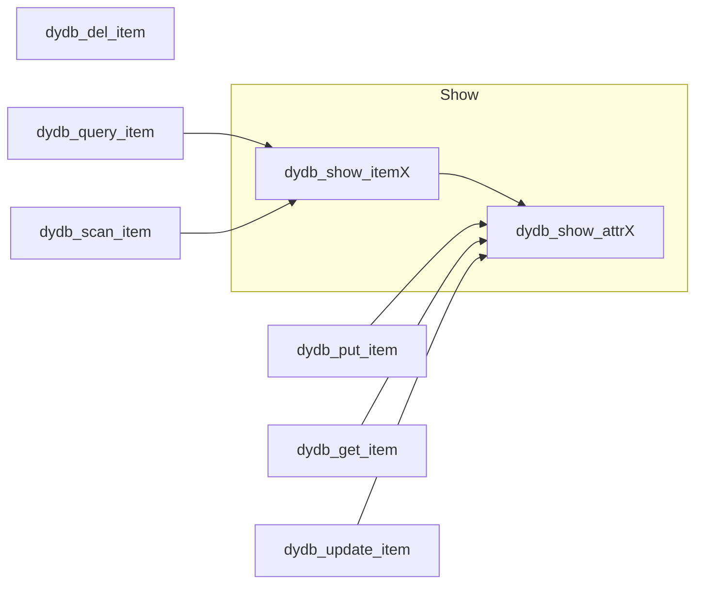

# 1. Overview
awsX9 is an api of [AWS SDK (C++)](https://github.com/aws/aws-sdk-cpp). We can save our time from learning AWS SDK.

Please also read [helper_AWS-CLI.md](https://github.com/lankahsu520/HelperX/blob/master/helper_AWS-CLI.md) and [helper_AWS-SDK.md](https://github.com/lankahsu520/HelperX/blob/master/helper_AWS-SDK.md).

# 2. Depend on
- [utilx9](https://github.com/lankahsu520/utilx9)
- [AWS SDK (C++)](https://www.silabs.com/wireless/z-wave)

# 3. Current Status


# 4. Build
   ```bash
$ vi utilx9/conf/github.conf
export PJ_HAS_AWSX9=yes
export PJ_HAS_AWS_SDK_CPP=yes
# please build AWS SDK C++ by yourself.
# or update utilx9/user/library_pub.mk
$ make
   ```

# 5. Example or Usage
- awsx_123 - an example. to get item from Amazon DynamoDB.

```mermaid
flowchart LR
	subgraph Show
		dydb_show_attrX
		dydb_show_itemX --> dydb_show_attrX
	end
	dydb_del_item
	dydb_put_item --> dydb_show_attrX
	dydb_get_item --> dydb_show_attrX
	dydb_update_item --> dydb_show_attrX
	dydb_query_item --> dydb_show_itemX
	dydb_scan_item --> dydb_show_itemX
```
```json
{
 "Artist": "Lanka",
 "SongTitle": "Lanka",
 "AlbumTitle": "Album123",
 "Awards": "1",
 "Sponsor": [
  "dog",
  "mouse",
  "tiger"
 ]
}
```
```json
{
 "Artist": "Lanka",
 "SongTitle": "Lanka",
 "AlbumTitle": "Album123",
 "Awards": "2",
 "Sponsor": [
  "dog",
  "mouse",
  "tiger"
 ]
}
```

```bash
$ ./awsx_123
[258426/258426] dydb_del_item:154 - DeleteItem ok !!! (table_name: Music, Artist: Lanka, SongTitle: Lanka)
[258426/258426] dydb_put_item:254 - PutItem ok !!! (table_name: Music, Artist: Lanka, SongTitle: Lanka)
[258426/258426] dydb_get_item:210 - GetItem ok !!! (table_name: Music, Artist: Lanka, SongTitle: Lanka, attr_size: 5)
[258426/258426] dydb_show_attr:49 - (STRING: {"S":"Album123"}, AlbumTitle: Album123)
[258426/258426] dydb_show_attr:49 - (STRING: {"S":"Lanka"}, Artist: Lanka)
[258426/258426] dydb_show_attr:49 - (STRING: {"S":"1"}, Awards: 1)
[258426/258426] dydb_show_attr:49 - (STRING: {"S":"Lanka"}, SongTitle: Lanka)
[258426/258426] dydb_show_attr:74 - (ATTRIBUTE_LIST: {"L":[{"S":"dog"},{"S":"mouse"},{"S":"tiger"}]})
[258426/258426] dydb_show_attr:77 - (Sponsor[0]: dog)
[258426/258426] dydb_show_attr:77 - (Sponsor[1]: mouse)
[258426/258426] dydb_show_attr:77 - (Sponsor[2]: tiger)
[258426/258426] dydb_update_item:440 - UpdateItem ok !!! (table_name: Music, Artist: Lanka, SongTitle: Lanka)
[258426/258426] dydb_get_item:210 - GetItem ok !!! (table_name: Music, Artist: Lanka, SongTitle: Lanka, attr_size: 5)
[258426/258426] dydb_show_attr:49 - (STRING: {"S":"Album123"}, AlbumTitle: Album123)
[258426/258426] dydb_show_attr:49 - (STRING: {"S":"Lanka"}, Artist: Lanka)
[258426/258426] dydb_show_attr:49 - (STRING: {"S":"2"}, Awards: 2)
[258426/258426] dydb_show_attr:49 - (STRING: {"S":"Lanka"}, SongTitle: Lanka)
[258426/258426] dydb_show_attr:74 - (ATTRIBUTE_LIST: {"L":[{"S":"dog"},{"S":"mouse"},{"S":"tiger"}]})
[258426/258426] dydb_show_attr:77 - (Sponsor[0]: dog)
[258426/258426] dydb_show_attr:77 - (Sponsor[1]: mouse)
[258426/258426] dydb_show_attr:77 - (Sponsor[2]: tiger)
[258426/258426] dydb_query_item:322 - Query ok !!! (table_name: Music, Artist: Lanka, items_size: 2)
[258426/258426] dydb_show_itemX:113 - ——————————————————————————————————————————————————
[258426/258426] dydb_show_itemX:117 - __________ 000 __________
[258426/258426] dydb_show_attr:49 - (STRING: {"S":"Album123"}, AlbumTitle: Album123)
[258426/258426] dydb_show_attr:49 - (STRING: {"S":"Lanka"}, Artist: Lanka)
[258426/258426] dydb_show_attr:49 - (STRING: {"S":"2"}, Awards: 2)
[258426/258426] dydb_show_attr:49 - (STRING: {"S":"Lanka"}, SongTitle: Lanka)
[258426/258426] dydb_show_attr:74 - (ATTRIBUTE_LIST: {"L":[{"S":"dog"},{"S":"mouse"},{"S":"tiger"}]})
[258426/258426] dydb_show_attr:77 - (Sponsor[0]: dog)
[258426/258426] dydb_show_attr:77 - (Sponsor[1]: mouse)
[258426/258426] dydb_show_attr:77 - (Sponsor[2]: tiger)
[258426/258426] dydb_show_itemX:117 - __________ 001 __________
[258426/258426] dydb_show_attr:49 - (STRING: {"S":"Lanka520"}, AlbumTitle: Lanka520)
[258426/258426] dydb_show_attr:49 - (STRING: {"S":"Lanka"}, Artist: Lanka)
[258426/258426] dydb_show_attr:49 - (STRING: {"S":"1"}, Awards: 1)
[258426/258426] dydb_show_attr:49 - (STRING: {"S":"Lanka520520"}, SongTitle: Lanka520520)
[258426/258426] dydb_show_attr:74 - (ATTRIBUTE_LIST: {"L":[{"S":"dog"},{"S":"cat"},{"S":"mouse"},{"S":"stoat"},{"S":"snake"}]})
[258426/258426] dydb_show_attr:77 - (Sponsor[0]: dog)
[258426/258426] dydb_show_attr:77 - (Sponsor[1]: cat)
[258426/258426] dydb_show_attr:77 - (Sponsor[2]: mouse)
[258426/258426] dydb_show_attr:77 - (Sponsor[3]: stoat)
[258426/258426] dydb_show_attr:77 - (Sponsor[4]: snake)
[258426/258426] dydb_show_itemX:127 - __________ End __________
[258426/258426] dydb_scan_item:382 - Query ok !!! (table_name: Music, Artist: Lanka, items_size: 6)
[258426/258426] dydb_show_itemX:113 - ——————————————————————————————————————————————————
[258426/258426] dydb_show_itemX:117 - __________ 000 __________
[258426/258426] dydb_show_attr:49 - (STRING: {"S":"Somewhat Famous"}, AlbumTitle: Somewhat Famous)
[258426/258426] dydb_show_attr:49 - (STRING: {"S":"No One You Know"}, Artist: No One You Know)
[258426/258426] dydb_show_attr:49 - (STRING: {"S":"1"}, Awards: 1)
[258426/258426] dydb_show_attr:49 - (STRING: {"S":"Call Me Today"}, SongTitle: Call Me Today)
[258426/258426] dydb_show_itemX:117 - __________ 001 __________
[258426/258426] dydb_show_attr:49 - (STRING: {"S":"Somewhat Famous"}, AlbumTitle: Somewhat Famous)
[258426/258426] dydb_show_attr:49 - (STRING: {"S":"No One You Know"}, Artist: No One You Know)
[258426/258426] dydb_show_attr:49 - (STRING: {"S":"2"}, Awards: 2)
[258426/258426] dydb_show_attr:49 - (STRING: {"S":"Howdy"}, SongTitle: Howdy)
[258426/258426] dydb_show_itemX:117 - __________ 002 __________
[258426/258426] dydb_show_attr:49 - (STRING: {"S":"Album123"}, AlbumTitle: Album123)
[258426/258426] dydb_show_attr:49 - (STRING: {"S":"Lanka"}, Artist: Lanka)
[258426/258426] dydb_show_attr:49 - (STRING: {"S":"2"}, Awards: 2)
[258426/258426] dydb_show_attr:49 - (STRING: {"S":"Lanka"}, SongTitle: Lanka)
[258426/258426] dydb_show_attr:74 - (ATTRIBUTE_LIST: {"L":[{"S":"dog"},{"S":"mouse"},{"S":"tiger"}]})
[258426/258426] dydb_show_attr:77 - (Sponsor[0]: dog)
[258426/258426] dydb_show_attr:77 - (Sponsor[1]: mouse)
[258426/258426] dydb_show_attr:77 - (Sponsor[2]: tiger)
[258426/258426] dydb_show_itemX:117 - __________ 003 __________
[258426/258426] dydb_show_attr:49 - (STRING: {"S":"Lanka520"}, AlbumTitle: Lanka520)
[258426/258426] dydb_show_attr:49 - (STRING: {"S":"Lanka"}, Artist: Lanka)
[258426/258426] dydb_show_attr:49 - (STRING: {"S":"1"}, Awards: 1)
[258426/258426] dydb_show_attr:49 - (STRING: {"S":"Lanka520520"}, SongTitle: Lanka520520)
[258426/258426] dydb_show_attr:74 - (ATTRIBUTE_LIST: {"L":[{"S":"dog"},{"S":"cat"},{"S":"mouse"},{"S":"stoat"},{"S":"snake"}]})
[258426/258426] dydb_show_attr:77 - (Sponsor[0]: dog)
[258426/258426] dydb_show_attr:77 - (Sponsor[1]: cat)
[258426/258426] dydb_show_attr:77 - (Sponsor[2]: mouse)
[258426/258426] dydb_show_attr:77 - (Sponsor[3]: stoat)
[258426/258426] dydb_show_attr:77 - (Sponsor[4]: snake)
[258426/258426] dydb_show_itemX:117 - __________ 004 __________
[258426/258426] dydb_show_attr:49 - (STRING: {"S":"Songs About Life"}, AlbumTitle: Songs About Life)
[258426/258426] dydb_show_attr:49 - (STRING: {"S":"Acme Band"}, Artist: Acme Band)
[258426/258426] dydb_show_attr:49 - (STRING: {"S":"10"}, Awards: 10)
[258426/258426] dydb_show_attr:49 - (STRING: {"S":"Happy Day"}, SongTitle: Happy Day)
[258426/258426] dydb_show_itemX:117 - __________ 005 __________
[258426/258426] dydb_show_attr:49 - (STRING: {"S":"Another Album Title"}, AlbumTitle: Another Album Title)
[258426/258426] dydb_show_attr:49 - (STRING: {"S":"Acme Band"}, Artist: Acme Band)
[258426/258426] dydb_show_attr:49 - (STRING: {"S":"8"}, Awards: 8)
[258426/258426] dydb_show_attr:49 - (STRING: {"S":"PartiQL Rocks"}, SongTitle: PartiQL Rocks)
[258426/258426] dydb_show_itemX:127 - __________ End __________
[258426/258426] main:255 - Bye-Bye !!!

```

# 6. License

awsX9 is under the New BSD License (BSD-3-Clause).


# 7. Documentation
Run an example and read it.
